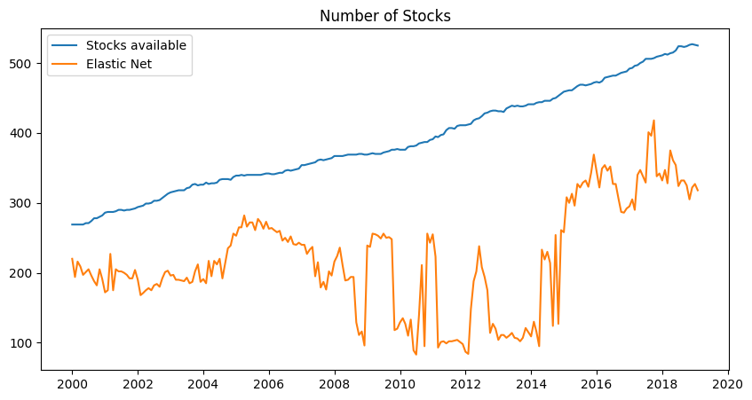

# Rgularization Tecnique applied on Portfolio Optimization of S&P 500
## Overview

This project involves analyzing the S&P 500 stock index data and trying to create the global minimum variance portfolios with less assets than the index. In addition, the various historical components are take under consideration since each simulation take in account only the basket of stocks in the index at the beginning of the window. This limits the survival bias but doesn't remove the problem: the data for the not active stocks are not take in consideration because the lack of this data.
The analysis includes data preparation, model building, and result evaluation. The main goals are to compute returns, find the efficient frontier, perform both linear and elastic net regressions, and analyze the results obtain from different portfolios with new data.

Regularization ability across all the simulation

### Table of Contents

    Data preparation
        Rolling windows setup
        Record windows composition
        Scraping stock prices
        Obtain stock sectors
    Models
        Compute returns
        Train and test split
        Find efficient frontier
        Perform linear regression and elastic net
        Performance metrics on efficient frontier, regression models, and equally weighted portfolios
    Analysis of the results
        Comparison of the metrics
        Sectors influence
        Final remarks

### Data Preparation

Creation of an index of 230 rolling windows, each spanning 10 years, starting from January 1, 1995, to February 1, 2024, with a monthly offset.

Obtain from various source the historical S&P 500 data, focusing on adjusted close prices from January 1, 1995, to February 1, 2024. Data is adjusted to the specific rolling windows.

### Models

Returns are computed for each stock within the defined rolling windows.

The data is split into training and testing sets to evaluate model performance.

The efficient frontier is calculated to identify the optimal portfolio allocation.

Linear regression and elastic net models are employed to data.

### Performance Metrics

Performance metrics are calculated for the efficient frontier, regression models, and equally weighted portfolios.

Compare the performance metrics of different models and approaches.

The influence of different sectors on the overall performance is analyzed.
Final Remarks

Conclusions and final thoughts on the analysis are provided.

Returns on test 5 years portfolios across the simulations